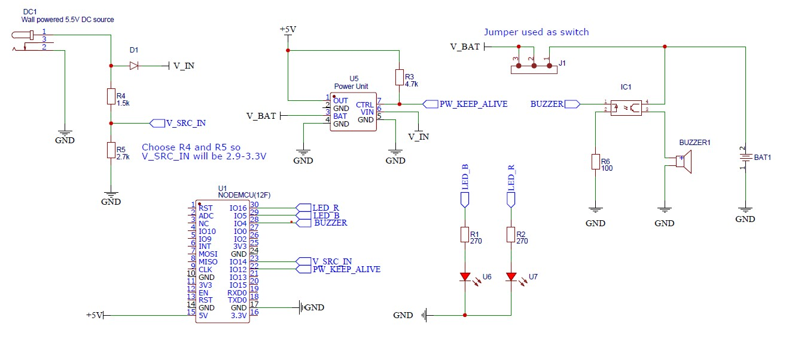

# AC Power Mains - monitor and alarm

This is a device that monitors the mains AC power supply and starts an alarm when it goes out.

The AC alarming system contains the following main modules:
    
- **Node MCU** (ESP8266) controller that implements the device logic.
- External 5.5V DC power brick
- 4.2V (3000 mAh) Li-Ion Battery cell
- Power supply module - that acts as an UPS being powered by an external DC source, managing a Li-Ion battery cell and providing an 5V DC output voltage.
- Buzzer - for sound alarm

## How does it work?

The DC power brick is powered directly from the AC mains being monitored. This provides power on UPS module input that keeps the battery cell charged and therefore provides power for the rest of the electronics connected to the UPS output port.

The the voltage provided by the power brick is monitored by the controller device using a simple connection (the output of a voltage divider connected to one of the DI pins available). As long as the voltage level on UPS input is ok (for a high logic state), the signaling LEDs and buzzer alarm are turned off.

When the input power goes out, the UPS module interrupts its output for a fraction of a second and switches the power source. The battery cell will provide now the necessary power (until the AC mains is restored). This time, the monitoring input is LOW (no voltage at the voltage divider input), therefor the LED's and the buzzer are active, signaling that the main supply is out.

## Schematic

The schematic containing the elements mentioned before can be found in this section. Also, the PDF file is available within repository.



>**NOTE!**
>
>The values used for resistors are informative. They are not necessary the ones I used in the final version. Check the data sheets of your devices and choose the proper values.


## Code 

The coding part is very simple and efficient.

First of all, there are some constants that ware used to define the inputs and outputs

```c++
#define LED_B 5             //D1
#define LED_R 16            //D0
#define BUZZER 4            //D2
#define V_BAT_IN 13         //D7
#define V_SRC_IN 14         //D5
#define PW_KEEP_ALIVE 12    //D6
```

Then, there are some global variables used mostly to keep track of some state machines implemented for LEDs buzzer. You can see them in the file containing the source code.

The `setup` function follows next. This one defines the operating mode of the pins and initializes a timer by specifying its activation interval (100 ms) and the callback function that will service the interrupt.

```c++
void setup() {
  pinMode(LED_B, OUTPUT);
  digitalWrite(LED_B, LOW);
  pinMode(LED_R, OUTPUT);
  digitalWrite(LED_R, LOW);
  pinMode(PW_KEEP_ALIVE, OUTPUT);
  digitalWrite(PW_KEEP_ALIVE, HIGH);
  analogWrite(BUZZER, BUZZER_OFF);
  
  pinMode(V_SRC_IN, INPUT);

  myTimer.attach(0.1, &onTimer);
}
```

There are tree finite state machines (FSM) defined to implement an LED light play, a sound play for the buzzer and a control sequence for the UPC module

The functions that provide light and sound play are listed below.

```c++
void led_task(){
  switch(led_task_state){
    case 0:{
      digitalWrite(LED_B, HIGH);
      digitalWrite(LED_R, LOW);
      led_task_state++;
      break;
    }
    case 1:{
      digitalWrite(LED_B, LOW);
      digitalWrite(LED_R, HIGH);
      led_task_state++;
      break;
    }
    default:{
      led_task_state=0;
      break;
    }
  }
}
```

```c++
void buzzer_task(){
  switch(buzzer_task_state){
    case 0:{
      analogWrite(BUZZER, 0);
      buzzer_task_state++;
      break;
    }
    case 1:{
      analogWrite(BUZZER, 20);
      buzzer_task_state++;
      break;
    }
    case 2:{
      analogWrite(BUZZER, 40);
      buzzer_task_state++;
      break;
    }
    case 3:{
      analogWrite(BUZZER, 80);
      buzzer_task_state++;
      break;
    }
    case 4:{
      analogWrite(BUZZER, 100);
      buzzer_task_state++;
      break;
    }
    case 5:{
      analogWrite(BUZZER, 200);
      buzzer_task_state++;
      break;
    }
    case 6:{
      analogWrite(BUZZER, 80);
      buzzer_task_state++;
      break;
    }
    case 7:{
      analogWrite(BUZZER, 40);
      buzzer_task_state++;
      break;
    }
    case 8:{
      analogWrite(BUZZER, 20);
      buzzer_task_state++;
      break;
    }
    case 9:{
      analogWrite(BUZZER, 10);
      buzzer_task_state++;
      break;
    }

    default:{
      buzzer_task_state=0;
      break;
    }
  }
}
```

Because of how the UPS module is implemented, it is necessary to provide a short LOW VOLTAGE pulse on the start input in order to keep the output power on for more than 30 seconds. So, once every 20 seconds, there is a LOW pulse of 200ms. This pulse is generated by a short state machine listed below.

```c++
void power_keepAlive_task(){
  switch(keepAlive_state){
    static uint16_t time_counter=0;
    time_counter++;
    case 0:{
      digitalWrite(PW_KEEP_ALIVE, HIGH);
      if (time_counter>=200){ //20sec
        keepAlive_state=1;
        time_counter=0;
      }
      break;
    }
    case 1:{
      digitalWrite(PW_KEEP_ALIVE, LOW);
      if (time_counter>=2){ //20 msec
        keepAlive_state=0;
        time_counter=0;
      }
      break;
    }
    default:{
      led_task_state=0;
      break;
    }
  }
}
```

> **NOTE!**
>
> Those tree functions are called every 100ms, based on the timer initialized in the `setup` function.

The main `loop` function implements the operating sequence of our device:
1. Gets the state of the monitoring input
1. Determines when there is a transition from VOLTAGE OK to VOLTAGE NOK to initialize the LED and BUZZER state machines
1. If there was a timer interrupt, all the tasks (for LED, BUZZER and Power Keep Alive signals) are called. The first two functions from the list before, are called only if `mains_nok` variable is `True`.

```c++
void loop() {
  if (digitalRead(V_SRC_IN)){
    mains_nok=false;
  }else{
    mains_nok=true;
  }

  //transition from mains ok to mains nok
  if (mains_nok_prev == false && mains_nok==true){
    led_task_state=0;
    buzzer_task_state=0;
  }
  mains_nok_prev=mains_nok;

  if (timer_new_tick){
    if (mains_nok){
      led_task();
      buzzer_task();
    }else{
      digitalWrite(LED_B, LOW);
      digitalWrite(LED_R, LOW);
      analogWrite(BUZZER, BUZZER_OFF);
    }
    power_keepAlive_task();
    timer_new_tick=false;
  }
}
```